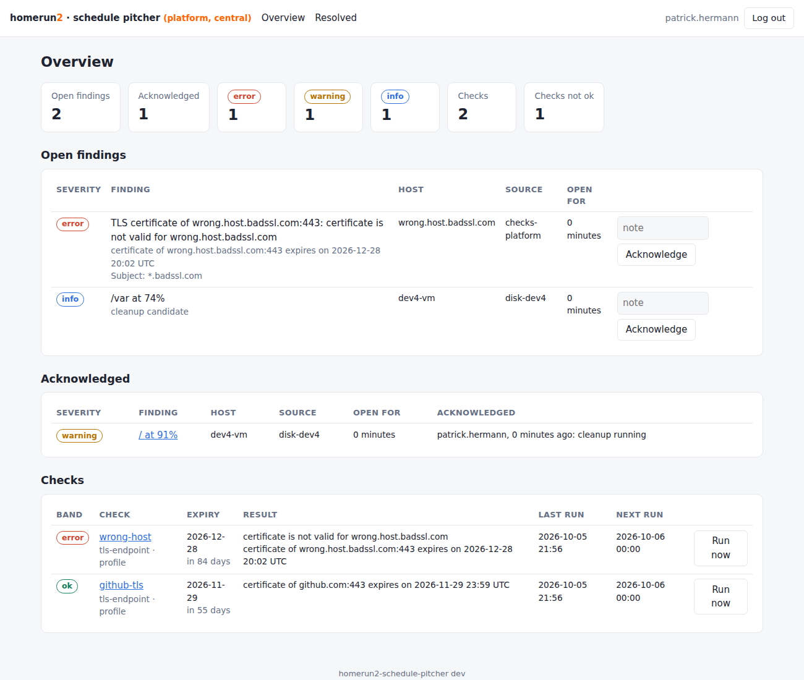

# homerun2-schedule-pitcher

homerun2 pitcher that runs scheduled checks (token & certificate expiry, probes) and user-defined reminders, and pitches the results into homerun2

> **Status: MVP in progress.** The design is tracked in
> [#1 Design: homerun2-schedule-pitcher](https://github.com/stuttgart-things/homerun2-schedule-pitcher/issues/1).
> Implemented so far: the scheduler core with the checks `github-token-expiry`
> and `tls-endpoint`, the state machine, delivery to omni-pitcher (`grafana` and
> `generic` format), state and history in Redis (or in memory without Redis),
> `/health`, `/ready`, `/metrics`, a small JSON API, and findings from other jobs
> with office-hours delivery, agents with discovery, CI workflows and KCL
> manifests. Still to come (MVP 2 in #1): the web UI and reminders.

## How it works

```
 cluster A                cluster B                 VMs, other jobs
 agent (run/serve) ──┐    agent ──┐                 cron + curl ──┐
                     └──────────────┴── POST /findings ────────────┘
                                         │
                          central instance on platform
                     (state in redis-stack, delivery, UI) ──▶ omni-pitcher ──▶ Teams
```

- The **central instance** (`serve` without `spec.report`) owns state and
  delivery. It runs its own checks too (e.g. TLS endpoints reachable from
  platform) and receives findings from agents and other jobs.
- An **agent** is the same binary with `spec.report`. It runs the checks of
  its cluster next to the secrets and sends only the results, as findings, to
  the central `POST /findings`. Secrets never leave the cluster, and platform
  needs no access into the clusters. Run it as a CronJob (`run`) or a small
  Deployment (`serve`, reports after every check run).

Check results become findings (source `checks-<metadata.name>`, key = check
id): a check that is not ok is a finding with its band as severity and the
days left as value; a check that cannot complete is an extra
`<id>:could-not-check` finding (`warning`); an ok check is absent, so its
finding resolves. They are then delivered in office hours like every other
finding (see below): `critical` at once, `error` at once inside office hours,
everything else in the hourly updates and the daily summaries.

`run` without `spec.report` keeps the original direct delivery, for CI and
one-off runs: it pitches to omni-pitcher when the state of a check changes:

| Situation | Pitch |
|---|---|
| Check enters a band (`warning` / `error` / `critical`) or changes band | immediately, with that severity |
| Check stays in a bad band | again at most once per `remind` cadence (default daily 08:00 Europe/Berlin) |
| Check is ok again (for example a token was rotated) | once, `success` / Grafana `resolved` |
| Check could not complete (network error, 5xx, missing Secret) | separate `warning` "Could not check …", rate-limited like reminders, never reported as an expiry |
| Token without expiry date | `info`, once |

Bands come from the time left until expiry: at or below `thresholds.warning`
is warning, `error` is error, `critical` or expired is critical. Defaults are
`30d`/`7d`/`1d`, and `30d`/`14d`/`3d` for `github-token-expiry`, since tokens
need more lead time to rotate. Precedence per field: check, `spec.defaults`,
type default, global default. A check can also raise the band itself: a token GitHub
rejects (`401`) is critical, a certificate that is not trusted or not valid for
the host name is error.

### Checks

| Type | What it does |
|---|---|
| `github-token-expiry` | `GET /rate_limit` with the token and reads the `github-authentication-token-expiration` header. `401` means expired or revoked. `GET /user` adds the token owner (`owner: false` turns that off). The token is read again on every run, so a rotated Secret is picked up. |
| `vault-token-ttl` | `GET /v1/auth/token/lookup-self` with the token itself against `addr` (Vault or OpenBao; `caFile`, `insecure`, `vaultNamespace`). Days left = `ttl`. A **periodic, renewable token with less than half of its period left is not being renewed** and is at least `warning` (the failure of stuttgart-things/stuttgart-things#3502, about two weeks early). `403` / bad token is `critical` (expired, revoked, or the policy lacks read on `auth/token/lookup-self`). `ttl: 0` (root, non-expiring) is `info` once. The check never renews the token. |
| `tls-endpoint` | TLS dial to `target` (`host[:port]`, port defaults to 443) with SNI, reads the leaf `NotAfter`, or the earliest `NotAfter` of the presented chain with `chain: true`. Trust and host name are verified against the system roots plus `caFile`. An expired certificate is still read and reported. |

### Profile

```yaml
apiVersion: homerun2.sthings.io/v1alpha1
kind: SchedulePitcherProfile
metadata:
  name: machinery
spec:
  redis:                       # optional; without it state is kept in memory
    addr: redis-stack.homerun2.svc.cluster.local
    port: "6379"               # password: REDIS_PASSWORD or password / passwordFrom
  pitcher:
    addr: https://omni.platform.sthings-vsphere.labul.sva.de/pitch/grafana
    format: grafana            # grafana (POST /pitch/grafana) | generic (POST /pitch)
    caFile: /etc/ssl/vault-pki-ca/ca.crt
    auth:
      tokenFrom:
        secretKeyRef: { name: omni-pitcher-labul-platform, namespace: crossplane-system, key: token }
  defaults:
    schedule: "0 */6 * * *"    # cron or @every 6h
    timezone: Europe/Berlin
    remind: "0 8 * * *"
    thresholds: { warning: 30d, error: 7d, critical: 1d }
    system: homerun2-schedule-pitcher
    assignee: patrick.hermann
    tags: [expiry]
  checks:
    - id: github-runner-pat
      type: github-token-expiry
      description: Fine-grained PAT used by ARC runners
      tokenFrom:
        secretKeyRef: { name: github-runner-token, namespace: tekton-ci, key: GITHUB_TOKEN }
      thresholds: { warning: 30d, error: 14d, critical: 3d }
      url: https://github.com/settings/personal-access-tokens
    - id: omni-platform-tls
      type: tls-endpoint
      target: omni.platform.sthings-vsphere.labul.sva.de
      caFile: /etc/ssl/vault-pki-ca/ca.crt
      chain: true
```

Secret values (`tokenFrom`, `passwordFrom`) take exactly one of
`secretKeyRef` (read through the Kubernetes API, in-cluster or `KUBECONFIG`;
a missing namespace means the pod's own), `env` or `file`.

Per check, `schedule`, `remind`, `thresholds` (field by field), `assignee` and
`tags` (added to the default tags) override `spec.defaults`. Further fields:
`description`, `url`, `assignee`, `paused`, `timeout` (default `10s`),
`apiURL` (GitHub Enterprise), `serverName` (TLS SNI / name to verify).
Unknown fields are rejected. See [`profiles/`](profiles/) for examples.

## Web UI

`/ui/` on every instance (the root `/` redirects there): open and
acknowledged findings with age, the checks with band, origin (profile or
discovered, read-only), expiry, last and next run, **run now**, a detail page
with history, and the resolved findings of the retention window. An agent
shows its checks only.



The look is the one of the other homerun2 UIs (core-catcher). Log in with
your name and the `AUTH_TOKEN`; the name is recorded on acknowledgements.
The token is in the Secret `<name>-token` (key `auth-token`), which the login
page names as well:

```bash
kubectl -n homerun2 get secret homerun2-schedule-pitcher-token -o jsonpath='{.data.auth-token}' | base64 -d
# or from Git (platform-sthings):
sops -d clusters/labul/vsphere/platform-sthings/apps/homerun2-schedule-pitcher-secrets.enc.yaml
```
 The session is a signed, HttpOnly, SameSite=Strict cookie
valid for 12 hours; rotating `AUTH_TOKEN` ends all sessions. Pages are
server-rendered and need no JavaScript. Cross-site form posts are rejected.

## Heartbeat and watchdog

Who watches the watcher (central instance, on by default):

- **Heartbeat:** a daily `info` message "schedule-pitcher alive" (default 08:00) with version, checks (total / not ok), open findings by severity and when each source last reported. Metric `schedule_pitcher_heartbeat_timestamp_seconds`: alert elsewhere (Grafana, scout) when it stops moving, e.g. `time() - schedule_pitcher_heartbeat_timestamp_seconds > 26*3600`.
- **Watchdog:** the central instance records every source's last report (`schedule_pitcher_source_last_report_timestamp_seconds{source}`). An agent source (`checks-*`) silent for longer than `staleAfter` becomes a `warning` finding "No report from checks-sthings-infra for 14 hours" (source `schedule-pitcher-watchdog`). It resolves by itself once the agent reports again. Other sources, e.g. daily cron jobs, are watched only when listed.

```yaml
spec:
  heartbeat:
    schedule: "0 8 * * *"   # alive message
    staleAfter: 13h         # agents (checks-*): two missed 6-hourly runs
    sources:
      disk-dev4: 26h        # a daily cron job
    # enabled: false
```

> The heartbeat is `info`. The platform's notification-catcher forwards
> grafana-format messages to Teams only from `warning` up and `success`, so
> `info` needs its own output (`system: homerun2-schedule-pitcher`,
> `severity: info`).

## Discovery

With `spec.discovery.enabled` an instance (usually an agent) turns every
Secret with the label `homerun2.sthings.io/watch-expiry` into a check: `true`
or `github-token` gives `github-token-expiry`, `vault-token` gives
`vault-token-ttl` (which also needs the annotation
`homerun2.sthings.io/vault-addr`), and rescans every `interval` (default 1h). New
Secrets are checked right away; removed ones drop out of the next report, so
their findings resolve. A scan that cannot list a namespace only adds checks
and never removes any.

```yaml
spec:
  discovery:
    enabled: true
    namespaces: [flux-system, tekton-ci, argocd]   # empty = all namespaces
    labelSelector: homerun2.sthings.io/watch-expiry in (true,github-token,vault-token)
    interval: 1h
```

```bash
kubectl -n flux-system label secret git-token-auth homerun2.sthings.io/watch-expiry=true

kubectl -n openbao label secret openbao-transit-seal homerun2.sthings.io/watch-expiry=vault-token
kubectl -n openbao annotate secret openbao-transit-seal \
  homerun2.sthings.io/vault-addr=https://vault-vsphere.tiab.labda.sva.de:8200 \
  homerun2.sthings.io/ca-file=/etc/ssl/custom/trust-bundle.pem
```

The key that holds the token is found without annotation when the Secret has
one key, or one of `token`, `GITHUB_TOKEN`, `github_token`, `password` (in
this order), which covers Flux `git-token-auth`, Argo CD repository secrets,
Tekton and Backstage. Optional annotations (prefix `homerun2.sthings.io/`):
`token-key`, `check-id` (default `<namespace>.<name>`), `description`, `url`,
`tags` (comma-separated), `assignee`, `api-url` (GitHub Enterprise), and for
Vault tokens `vault-addr`, `vault-namespace`, `ca-file` (keys tried: `token`,
`VAULT_TOKEN`, `vault-token`, `vault_token`).
Checks in `spec.checks` win over discovered ones with the same id.

> **RBAC:** discovery needs `list` on Secrets, and Kubernetes returns the
> data with it: the agent can read every Secret in the namespaces it scans.
> Keep `namespaces` to the ones that hold watched tokens, with a `Role` per
> namespace instead of a `ClusterRole`.

## Findings from other jobs

Jobs that already run somewhere (a cron job on a VM, an Ansible run, a
Kubernetes CronJob) report what they found with `POST /findings`. Each call
carries the **complete current set** of findings of one `source`:

- a key missing from the next call is **resolved** automatically, so a job
  never has to report "ok";
- a key that comes back within the retention (7 days) **reopens** the old
  finding (first seen, history and acknowledgement note are kept);
- an empty `findings` list resolves everything of that source.

```bash
#!/bin/sh
# cron job on a VM: report every filesystem above 70 %
FINDINGS=$(df -P -x tmpfs -x devtmpfs | awk -v host="$(hostname -f)" 'NR > 1 {
  pct = $5; sub("%", "", pct); pct += 0
  if (pct < 70) next
  sev = pct >= 95 ? "critical" : (pct >= 85 ? "warning" : "info")
  printf "%s{\"key\":\"%s/disk:%s\",\"title\":\"%s at %d%%\",\"severity\":\"%s\",\"value\":%d,\"threshold\":70,\"host\":\"%s\",\"tags\":[\"disk\"]}",
    n++ ? "," : "", host, $6, $6, pct, sev, pct, host }')

curl -sf -X POST https://schedule-pitcher.example/findings \
  -H "Authorization: Bearer $SCHEDULE_PITCHER_TOKEN" \
  -d "{\"source\":\"disk-$(hostname -s)\",\"run\":\"$(date +%Y%m%d%H%M)\",\"findings\":[$FINDINGS]}"
```

Fields per finding: `key` (stable across runs, e.g. `<host>/<check>[:<detail>]`),
`title`, `severity` (`info`, `warning`, `error`, `critical`), and optionally
`message`, `value`, `threshold`, `host`, `tags`, `url`. Use one `source` per
job and host, since a call replaces the whole set of its source.

Delivery, every day in `spec.defaults.timezone` (office hours 08–18 by
default, `spec.findings.officeHours`):

| When | What |
|---|---|
| immediately | `critical` (any time), new or worse `error` (inside office hours) |
| immediately | the **resolution** of a finding that was pitched immediately (`success`, Grafana `resolved`, same fingerprint), at any time, so an alarm in the channel gets its all-clear; the hourly update does not repeat it |
| hourly 09:00–17:00 | one message with what is new, reopened, worse, acknowledgement expired or resolved since the last one; nothing new means no message |
| 08:00 | start of day: everything open, oldest first with age, and what the night brought or resolved |
| 18:00 | end of day: resolved today, still open |

A summary that could not be delivered is sent at the next tick (start of day
until the end of office hours, end of day until midnight).

**Acknowledge** = someone is on it: `POST /api/findings/ack` with
`{"source": "...", "key": "...", "by": "patrick.hermann", "note": "cleanup running"}`.
The finding stays in the summaries, marked as acknowledged. After
`spec.findings.ackExpiry` (default 3 days) without being resolved it is open
again and re-surfaces in the next update. Resolved findings are deleted after
`spec.findings.retention` (default 7 days).

```yaml
spec:
  findings:
    officeHours: { start: 8, end: 18 }
    ackExpiry: 3d
    retention: 7d
```

## Commands

```bash
# Scheduler + HTTP API (default command)
homerun2-schedule-pitcher serve --profile /etc/homerun2-schedule-pitcher/profile.yaml

# One pass, no state, then exits. Without spec.report it pitches everything
# that is not ok (CI, ScheduledRun); with spec.report (agent as CronJob) it
# sends one complete report to the central instance.
# --dry-run prints the messages or the report instead.
homerun2-schedule-pitcher run --profile profile.yaml [--dry-run] [--check <id>]
```

Agent profile (see [`profiles/agent-machinery.yaml`](profiles/agent-machinery.yaml)):

```yaml
spec:
  report:
    addr: https://schedule-pitcher.platform.example/findings
    source: checks-machinery      # default checks-<metadata.name>
    caFile: /etc/ssl/vault-pki-ca/ca.crt
    auth:
      tokenFrom:
        secretKeyRef: { name: schedule-pitcher-central, key: token }
  checks: [...]
```

## API Endpoints

| Endpoint | Method | Auth | Description |
|----------|--------|------|-------------|
| `/ui/` | `GET` | Login | Web UI |
| `/health` | `GET` | None | Liveness (version, commit, date) |
| `/ready` | `GET` | None | `200` once the scheduler runs and the state store answers |
| `/metrics` | `GET` | None | Prometheus metrics |
| `/api/checks` | `GET` | Bearer | All checks with band, expiry, last result, next run |
| `/api/checks/{id}/run` | `POST` | Bearer | Run a check now; returns its new state |
| `/api/checks/{id}/history?limit=N` | `GET` | Bearer | Last runs of a check, newest first (default 20, max 100) |
| `/findings` | `POST` | Bearer | Report the complete current findings of one source |
| `/api/findings?status=&source=` | `GET` | Bearer | Findings, worst first; `status` is `open` (incl. acknowledged), `acknowledged` or `resolved` |
| `/api/findings/ack` | `POST` | Bearer | Acknowledge a finding |

### State in Redis

With `spec.redis.addr` (or `REDIS_ADDR`) the state survives restarts and is
shared between replicas; without it the service keeps state in memory and
pitches a check that is not ok once more after a restart. Keys (prefix
`homerun2-schedule-pitcher:`, `spec.redis.prefix` changes it):

| Key | Type | Content |
|---|---|---|
| `…:check:<id>:state` | hash | band, expiry, summary, problem, failing, last error, what was pitched when (`redis-cli HGETALL`) |
| `…:check:<id>:history` | stream | last 100 runs, one JSON `entry` each |
| `…:lock:<id>` | string + TTL | run lock with an owner token, so two replicas never run the same check at once |
| `…:finding:<source>:<key>` | hash | one finding: JSON `doc` plus flat `source`, `key`, `status`, `severity`, `host`, `tags`, `first_seen`, `last_seen`, `resolved_at` |
| `…:findings` | set | keys of all findings |
| `…:findings:delivery` | string | when the last update and summaries were sent |

The flat finding fields are laid out for RediSearch, so an index can be added
over the existing data without migration, e.g.
`FT.CREATE findings-v1 ON HASH PREFIX 1 homerun2-schedule-pitcher:finding: SCHEMA source TAG status TAG severity TAG host TAG first_seen NUMERIC SORTABLE`.

Metrics: `schedule_pitcher_check_last_run_timestamp_seconds{check}`,
`schedule_pitcher_check_status{check}` (0 ok … 3 critical, -1 unknown),
`schedule_pitcher_check_failing{check}`,
`schedule_pitcher_check_expiry_seconds{check}`,
`schedule_pitcher_pitch_total{result}`.

## Configuration

| Variable | Description | Default |
|----------|-------------|---------|
| `PROFILE_PATH` | Path to the profile (`--profile` overrides) | `/etc/homerun2-schedule-pitcher/profile.yaml` |
| `PORT` | HTTP server port | `8080` |
| `AUTH_TOKEN` | Bearer token for `/api/*` and `POST /findings`, and the UI login | (required) |
| `PITCH_TARGET` | `http` (omni-pitcher from the profile), `file` or `stdout` | `http` |
| `PITCH_FILE` | File for `PITCH_TARGET=file` (JSON lines) | `pitched.log` |
| `PITCHER_ADDR` | Overrides `spec.pitcher.addr` | |
| `PITCHER_TOKEN` | Overrides `spec.pitcher.auth` | |
| `REPORT_ADDR` | Overrides `spec.report.addr`; makes the instance an agent | |
| `REPORT_TOKEN` | Overrides `spec.report.auth` | |
| `REDIS_ADDR` | Overrides `spec.redis.addr`; enables the Redis store | |
| `REDIS_PORT` | Overrides `spec.redis.port` | `6379` |
| `REDIS_PASSWORD` | Overrides `spec.redis.password` / `passwordFrom` | |
| `POD_NAMESPACE` | Namespace for `secretKeyRef` without namespace | pod namespace |
| `LOG_FORMAT` | `json` or `text` | `json` |
| `LOG_LEVEL` | `debug`, `info`, `warn`, `error` | `info` |
| `AUTH_TOKEN_SECRET` | Secret named on the login page as the token's source | `homerun2-schedule-pitcher-token` |
| `LOG_HEALTH_CHECKS` | Also log `/health`, `/ready`, `/metrics` requests | `false` |

## Development

```bash
task run-once     # dry run of profiles/local.yaml (uses `gh auth token`)
task run-local    # serve profiles/local.yaml, pitching to stdout

go test ./...     # unit tests, no Redis or cluster needed (miniredis)
task lint
task build-scan-image-ko
```

The image is built with ko (`.ko.yaml`), there is no Dockerfile. Manifests
for the central instance and the agents come from the KCL module in
[`kcl/`](kcl/README.md); see [docs/deployment.md](docs/deployment.md) and
[docs/cicd.md](docs/cicd.md).

Each release also publishes the kustomize artifacts
`homerun2-schedule-pitcher-kustomize` (central) and
`homerun2-schedule-pitcher-agent-kustomize` (agent, without Roles).

```bash
task render-central   # KCL -> /tmp/schedule-pitcher-central.yaml
task render-agent     # KCL -> /tmp/schedule-pitcher-agent.yaml
```

## Links

- [Releases](https://github.com/stuttgart-things/homerun2-schedule-pitcher/releases)
- [homerun-library](https://github.com/stuttgart-things/homerun-library)
- [homerun2-omni-pitcher](https://github.com/stuttgart-things/homerun2-omni-pitcher)
